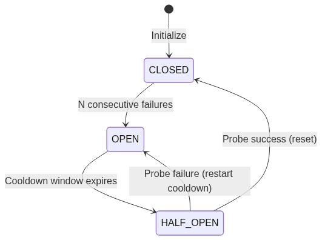
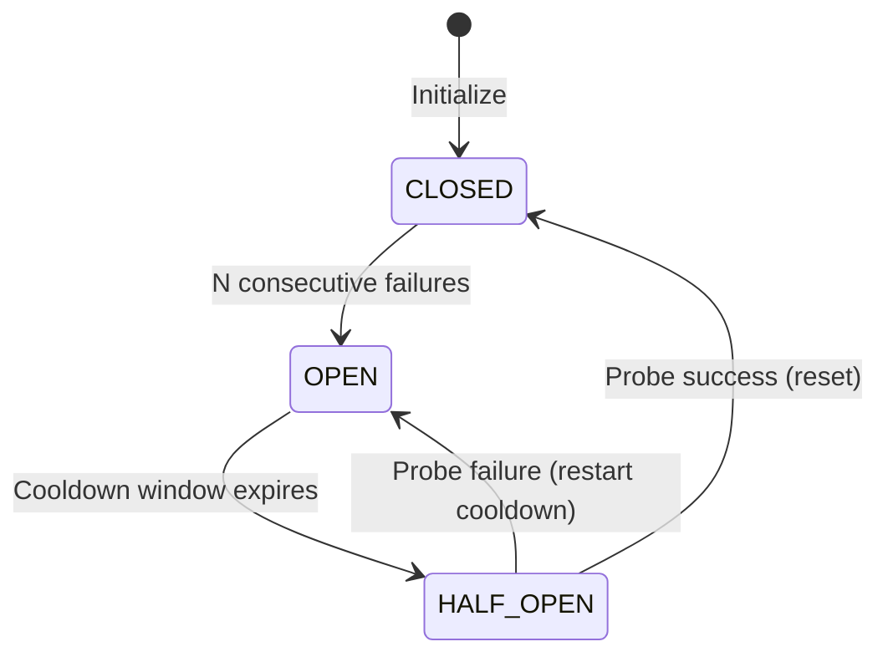
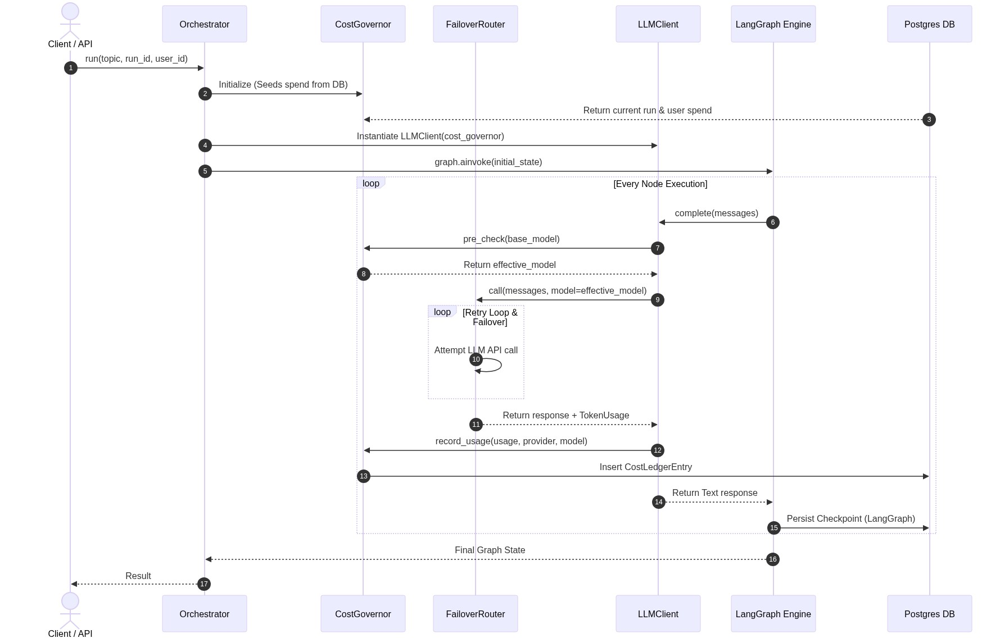
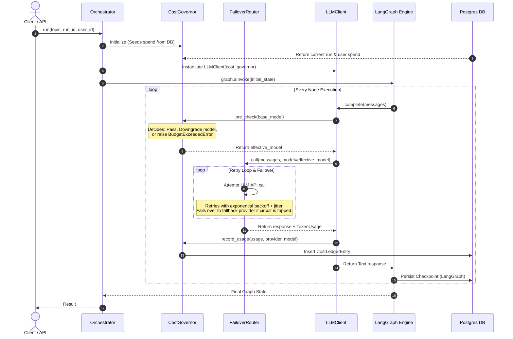
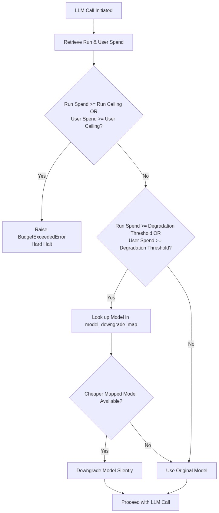
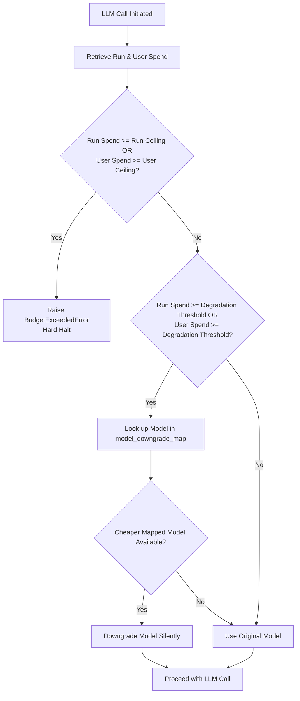

# AgentGuard — Robust Agent Runtime & Control Plane

AgentGuard is a production-grade **agent runtime and control plane** designed to run autonomous LLM agents safely, predictably, and reliably. By wrapping the agent graph, AgentGuard separates infrastructure concerns—provider failover, budget control, and state durability—from the agent's core research and reasoning logic.

---

## Key Capabilities

1. **Provider Failover & Circuit Breaking (Phase 1)**: Automatic retry with exponential backoff and randomized jitter. Employs a per-provider circuit breaker (Closed, Open, Half-Open) to fail-fast on unhealthy providers and probe for recovery, transparently falling back from Anthropic to OpenAI.
2. **Cost Governance & Graceful Degradation (Phase 2)**: Dual-scoped budget ceilings (per-run and cumulative per-user). Triggers model downgrades (e.g., swapping to Claude Haiku or GPT-4o-mini) when approaching thresholds to ensure runs finish instead of dying. Logs all token usage and model prices to an auditable Postgres `cost_ledger`.
3. **Durable & Resumable Checkpointing (Phase 3)**: LangGraph agent graph checkpoints persisted to Postgres after every step. Interrupted or crashed runs resume transparently from the last good step without re-executing completed steps.

---

## Architectural Diagrams

### 1. Circuit Breaker State Machine

Each provider is gated by a circuit breaker running a three-state machine:



<details>
<summary>Show Mermaid Source</summary>


</details>

### 2. Full Request Flow

The `Orchestrator` coordinates the components. The agent nodes have no knowledge of infra, failover, or databases; everything is intercepted at runtime.



<details>
<summary>Show Mermaid Source</summary>


</details>

### 3. Degradation-vs-Halt Decision Flow

The `CostGovernor` intercepts every LLM call before execution to enforce budget limits:



<details>
<summary>Show Mermaid Source</summary>


</details>

---

## Directory Structure

```
agentguard/
├── agents/
│   ├── coordinator.py           # LangGraph supervisor graph definition
│   ├── llm_client.py            # Unified multi-provider LLM client
│   └── worker_agents.py         # researcher / analyst / synthesizer nodes
├── config/
│   └── settings.py              # Pydantic settings & validation schemas
├── core/
│   ├── database.py              # Asyncpg connection pooling layer
│   ├── orchestrator.py          # Platform integration hub (wires all layers)
│   └── schemas.py               # Shared Pydantic data schemas
├── data/
│   └── schema.sql               # Database schema (cost_ledger & checkpoints)
├── runtime/
│   ├── checkpointer.py          # Phase 3: Postgres checkpointer saver manager
│   ├── cost_governor.py         # Phase 2: Budget ceilings & model degradation
│   └── failover.py              # Phase 1: Retry, backoff, and circuit breaker
├── tests/
│   ├── test_api.py              # FastAPI endpoint tests
│   ├── test_checkpointing.py    # LangGraph checkpoint persistence tests
│   ├── test_cost_governor.py    # Budget & ledger tests
│   └── test_failover.py         # Circuit breaker & retry tests
├── docker-compose.yml           # Postgres service container setup
├── main.py                      # FastAPI entry point & CLI commands
├── pyproject.toml               # Python packaging, metadata & dependencies
└── requirements.txt             # Dep list
```

---

## Setup & Running

This project uses `uv` for python virtualenv management, locking, and package synchronization.

### 1. Prerequisites
- Docker & Docker Compose (for Postgres database)
- Python 3.12+
- `uv` installed (`pip install uv` or `curl -sSf https://astral.sh/uv/install.sh | sh`)

### 2. Configure Environment Variables
Copy `.env.example` to `.env` and fill in your API credentials:
```bash
cp .env.example .env
```
Ensure `.env` matches your local config:
```ini
ANTHROPIC_API_KEY=sk-ant-yourkey...
OPENAI_API_KEY=sk-yourkey...
POSTGRES_PORT=5435
```

### 3. Install Dependencies
Sync project dependencies using `uv`:
```bash
uv sync
```
This automatically initializes a `.venv` directory and installs all dependencies declared in `pyproject.toml` and `requirements.txt`.

### 4. Start Database Service
Spin up Postgres database via Docker Compose:
```bash
docker compose up -d
```
This runs Postgres on port `5435` (configurable in `.env`) and automatically applies the schema defined in `data/schema.sql`.

### 5. Running the Application
To run the FastAPI server locally:
```bash
uv run uvicorn main:app --reload --port 8000
```
API Docs will be available at `http://127.0.0.1:8000/docs`.

### 6. Running Tests
The test suite contains 61 unit and integration tests. Run them using pytest within the `uv` environment:
```bash
uv run pytest tests/ -v
```

---

## API Documentation

### POST `/run`
Starts a new sequential agent research run.
- **Request Body**:
  ```json
  {
    "topic": "AI alignment techniques",
    "user_id": "user-42"
  }
  ```
- **Response**:
  ```json
  {
    "run_id": "run-a22cef6026b9",
    "completed_steps": ["researcher", "analyst", "synthesizer"],
    "messages": [
      "researcher: [Gathered data on AI alignment]",
      "analyst: [Analyzed findings]",
      "synthesizer: [Final Synthesis Report]"
    ]
  }
  ```

### POST `/resume`
Resumes an interrupted or failed run from its last checkpoint.
- **Request Body**:
  ```json
  {
    "run_id": "run-a22cef6026b9",
    "user_id": "user-42"
  }
  ```

### GET `/run/{run_id}`
Retrieves the current checkpoint status and next steps for a run.
- **Response**:
  ```json
  {
    "run_id": "run-a22cef6026b9",
    "has_checkpoint": true,
    "completed_steps": ["researcher"],
    "next_steps": ["analyst"]
  }
  ```
